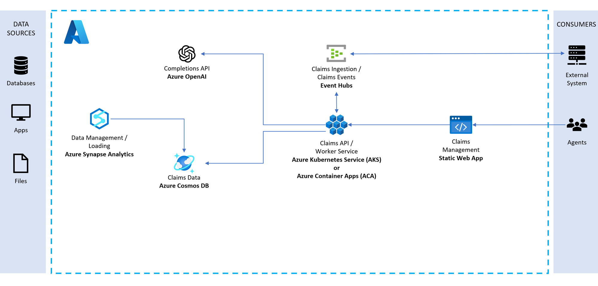
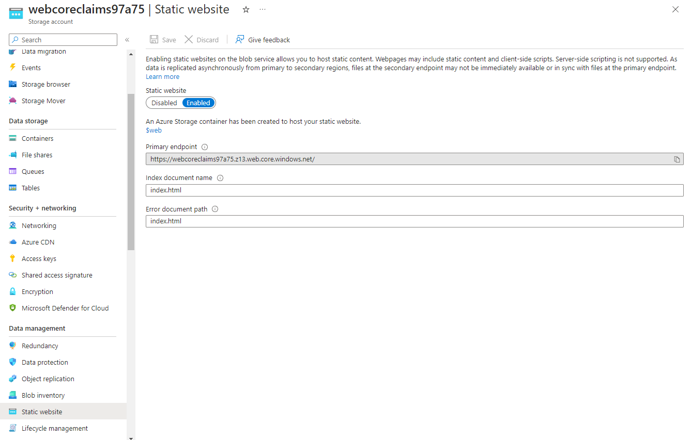

# Cosmos DB NoSQL API - Medical Claims Handling

## Introduction

This repository provides a code sample in .NET on how you might use a combination of Azure Functions, Cosmos DB, and EventHub to implement an event-driven medical insurance claims process. With minimal changes this could be modified to work for other insurance processes.

## Scenario

The scenario centers around a medical claims management solution. Members having coverage and making claims, providers who deliver services to the member and payers who provide the insurance coverage that pays providers for services to the members. 

Claims submitted are submitted in a stream and loaded into the backing database for review and approval.

Business rules govern the automated or human approval of claims. 

An AI powered co-pilot empowers agents with recommendations on how to process the claim.

## Solution Architecture

The solution architecture is represented by this diagram:

<p align="center">
    
</p>

## Prerequisites

### Prerequisites for running/debugging locally

- Backend (Function App, Console Apps, etc.)
  - Visual Studio 2022 17.6 or later (required for passthrough Visual Studio authentication for the Docker container)
  - .NET 7 SDK
  - Docker Desktop (with WSL for Windows machines)
  - Azure CLI ([v2.49.0 or greater](https://docs.microsoft.com/en-us/cli/azure/install-azure-cli))
  - [Helm 3.11.1 or greater](https://helm.sh/docs/intro/install/)
- Frontend (React web app)
  - Visual Studio Code
  - Ensure you have the latest version of NPM and node.js:
    - Install NVM from https://github.com/coreybutler/nvm-windows
    - Run nvm install latest
    - Run nvm list (to see the versions of NPM/node.js available)
    - Run nvm use latest (to use the latest available version)

To start the React web app:

1. Navigate to the `ui/medical-claims-ui` folder
2. Run npm install to restore the packages
3. Run npm run dev
4. Open localhost:3000 in a web browser

## Deployment

### Standard Deployments

From the `deploy/powershell` folder, run the following command. This should provision all of the necessary infrastructure, deploy builds to the function apps, deploy the frontend, and deploy necessary artifacts to the Synapse workspace.

```pwsh
.\Unified-Deploy.ps1 -resourceGroup <resource-group-name> `
                     -location EastUS `
                     -subscription <subscription-id>
```

### Cloud Shell Based Deployments

Create a cloud shell environment in a tenant that contains the target subscription.  Clone the repository and then execute the `CloudShell-Deploy.ps1` script as illustrated in the following snippet.  This will provision all of the required infrastructure and deploy the API and web app services into AKS.

```pwsh
git clone --recurse-submodules https://github.com/hatboyzero/ClaimsProcessing.git
cd ClaimsProcessing
chmod +x ./deploy/powershell/*
./deploy/powershell/CloudShell-Deploy.ps1 -resourceGroup <rg-name> `
                                          -location EastUS `
                                          -subscription <target-subscription>
```

### Azure VM Based Deployments

Run the following script to provision a development VM with Visual Studio 2022 Community and required dependencies preinstalled.

```pwsh
.\deploy\powershell\Deploy-Vm.ps1 -resourceGroup <rg-name> -location EastUS
```

When the script completes, the console output should display the name of the provisioned VM similar to the following:

```
The resource prefix used in deployment is libxarwttxjde
The deployed VM name used in deployment is libxarwttxjdevm
```

Use RDP to remote into the freshly provisioned VM with the username `BYDtoChatGPTUser` and password `Test123456789!`.  Open up a powershell terminal and run the following script to provision the infrastructure and deploy the API and frontend. This will provision all of the required infrastructure, deploy the API and web app services into AKS, and import data into Cosmos.

```pwsh
git clone --recurse-submodules https://github.com/hatboyzero/ClaimsProcessing.git
cd ClaimsProcessing
./deploy/powershell/Unified-Deploy.ps1 -resourceGroup <rg-name> `
                                       -location EastUS `
                                       -subscription <target-subscription>
```

### Publish the React web app after making changes

If you make changes to the React web app and want to redeploy it, run the following from the `deploy/powershell` folder:


```pwsh
./Publish-Site.ps1 -resourceGroup <resource-group-name> `
                     -storageAccount <storage-account-name (webcoreclaimsxxxx)>
```

### Enabling/Disabling Deployment Steps

The following flags can be used to enable/disable specific deployment steps in the `Unified-Deploy.ps1` script.

| Parameter Name | Description |
|----------------|-------------|
| stepDeployBicep | Enables or disables the provisioning of resources in Azure via Bicep templates (located in `./infrastructure`). Valid values are 0 (Disabled) and 1 (Enabled). See the `deploy/powershell/Deploy-Bicep.ps1` script.
| stepPublishFunctionApp | Enables or disables the publish and zip deployment of the `CorePayments.FunctionApp` project to the regional function apps present in the target resource group. Valid values are 0 (Disabled) and 1 (Enabled). See the `deploy/infrastructure/Publish-FunctionApp.ps1` script.
| stepDeployOpenAi | Enables or disables the provisioning of (or detection of an existing) Azure OpenAI service. If an explicit OpenAi resource group is not defined in the `openAiRg` parameter, the target resource group defaults to that passed in the `resourceGroup` parameter. Valid values are 0 (Disabled) and 1 (Enabled). See the `deploy/infrastructure/Deploy-OpenAi.ps1` script.
| stepPublishSite | Enables or disables the build and deployment of the static HTML site to the hosting storage account in the target resource group. Valid values are 0 (Disabled) and 1 (Enabled). See the `deploy/infrastructure/Publish-Site.ps1` script.
| stepSetupSynapse | Enables or disables the deployment of a Synapse artifacts to the target synapse workspace. Valid values are 0 (Disabled) and 1 (Enabled). See the `deploy/infrastructure/Setup-Synapse.ps1` script.
| stepLoginAzure | Enables or disables interactive Azure login. If disabled, the deployment assumes that the current Azure CLI session is valid. Valid values are 0 (Disabled). 

Example command:
```pwsh
cd deploy/powershell
./Unified-Deploy.ps1 -resourceGroup myRg `
                     -subscription 0000... `
                     -openAiName myOpenAi `
                     -openAiRg myOpenAiRg `
                     -openAiDeployment completions `
                     -stepLoginAzure 0 `
                     -stepDeployBicep 0 `
                     -stepPublishFunctionApp 1 `
                     -stepPublishSite 1
```

### Quickstart

1. After deployment is complete, go to the resource group for your deployment and open the Azure Storage Account prefixed with `web`.  This is the storage account hosting the static web app.
1. Select the `Static website` blade in the left-hand navigation pane and copy the site URL from the `Primary endpoint` field in the detail view.

    <p align="center">
        
    </p>

1. Browse to the URL copied in the previous step to access the web app.
 
> 
> Resources created:
> - Resource group
> - Azure Blob Storage (ADLS Gen2)
> - Azure Cosmos DB account (1 database with 1000 RUs autoscale shared with 4 collections, and 3 containers with dedicated RUs) with Analytical Store enabled
> - Azure Event Hub standard
> - Azure Functions Consumption Plan
> - Azure Application Insights
> - Azure OpenAI
> - Synapse Workspace (public access enabled)
>
> This setup will provision the Ingestion pipeline and supporting components in the Synapse workspace created in the previous step.
>
> Resources Created:
> - Linked Services for:
>   - Azure Blob Storage
>   - Azure Cosmos DB
> - Source/Sink datasets for the ingestion process
> - Pipeline for ingesting Synthea output into Cosmos Db Containers

## Ingest Sample Data

This will require logging into the azure portal, and accessing the Synapse workspace.

1. Log into the Synapse workspace in Synapse Studio
2. Locate the **Initial-Ingestion** pipeline in the **Integrate** section in the side menu
3. Click the **Add trigger -> Trigger now** button to run the pipeline

> The pipeline execution should take about 5 minutes to complete.  You can monitor the progress of the pipeline by clicking on the **Monitor** section in the side menu and selecting the **Pipeline runs** tab.

## Running the sample

You can run the sample application through the static website that was deployed as part of the setup process.

You can also work directly with the REST API by calling the Function App APIs from Azure Portal or your favorite tool.
> Postman Exports are included in the `/postman` folder

### Run the Claim Publisher

> This console app will generate random claims and publish them to the EventHub topic the FunctionApp subscribes to which then will be injested into Cosmos `Claim` container where we will store all Claim and Claim line item events data. **Take note of one of the ClaimId uuids output from this tool which has value over $500**.
>
> Console app has 2 **"RunMode"** options configurable in *settings.json* under `./src/CoreClaims.Publisher` : "OneTime" (default) and "Continous" 
> as well as **"BatchSize"** (default - 10), **"Verbose"** (default - True) and **"SleepTime"** (default - 1000 ms).
>
>  *settings.json* example:
```
{
  "GeneratorOptions": {
    "RunMode": "OneTime",
    "BatchSize": 10,
    "Verbose": true,
    "SleepTime": 1000
  },
  "CoreClaimsCosmosDB": {
    "accountEndpoint": "AccountEndpoint=https://*COSMOS_ACC_NAME*.documents.azure.com:443/;AccountKey=*COSMOS_ACC_KEY*;"
  },
  "CoreClaimsEventHub": {
    "fullyQualifiedNamespace": "Endpoint=sb://*YOUR_EH_NAME*.servicebus.windows.net/;SharedAccessKeyName=RootManageSharedAccessKey;SharedAccessKey=*EH_KEY*"
  }
}
```

```bash
cd ../src/CoreClaims.Publisher
dotnet run
```

## Interact with the React web app

Browse to the URL copied in the previous step to access the web app.

### Managing the claims flow

- When a new claim is added:
  - If the member this claim belongs to doesn't have a Coverage record that is active for the `filingDate`, the claim should be `Rejected`
  - If the `totalAmount` value is less than 200.00 (configurable) it should be `Approved`
  - If the `totalAmount` value is greater than 200.00, it should be `Assigned`
  - Finally, if your initial ingestion run has a large volume of claims, it's possible the ChangeFeed triggers are still catching up, and the status may be `Initial`
- When the claim is assigned to an adjudicator:
  - Go to the Adjudicator page and select **Acknowledge Claim Assignment** and observe the flow of the claim through the system (change feed triggers, etc.). There should be claims assigned to both the Non-Manager and the Manager Adjudicators.
- When the claim is acknowledged:
  - The claim should be `Assigned` to the Adjudicator
  - Selecting **Deny Claim** will finalize the claim as `Denied` and publish the final status of the claim to a `ClaimDenied` topic on the event hub
  - Selecting **Propose Claim** without applying discounts on the Line Items, or changing them such that the difference between the total before and after is less than $500.00 (configurable) will trigger an automatic approval
  - Selecting **Propose Claim** while applying discounts on the Line Items so the total before and after differs by more than $500.00 will trigger manager approval, updating the status to `ApprovalRequired` and assigning a new adjudicator manager to the claim. Since we are hard-coding the Non-Manager and Manager Adjudicators, you should be able to select the Manager tab and see the claim assigned to the Manager Adjudicator.

  > **Note**: If you propose a claim as an adjudicator manager, the claim will always be approved, regardless of the total discount amount.

- Reviewing the claim history:
  - Select **View History** on a claim row to see the history of the claim
  - All claims start in the `Initial` state, from here they can transition to
    - `Denied` if the member is uninsured
    - `Approved` if the total is less than 200
    - `Assigned` if the total is more than 200
  - From `Assigned` it transitions to `Acknowledged` when the adjudicator acknowledges the claim
  - From `Acknowledge` to
    - `Denied` if the adjudicator declines the claim
    - `Proposed` if the adjudicator proposes some updates
  - From `Proposed`
    - `Approved` if the changes are under a configured threshold
    - `ApprovalRequired` if the changes are over a threshold
  - From `ApprovalRequired` to
    - `Denied` or `Proposed`
- Final claim state:
  - Once a Claim reaches the `Denied` or `Approved` state, it will get published to another pair of EventHub topics for hypothetical downstream processing
  - Note that when a Claim gets to a final `Approved` state, the associated Member document within the `Member` container will get updated with increments of the following two attributes:
    - `approvedCount` - the number of claims that have been approved for this member
    - `approvedTotal` - the total amount of all claims that have been approved for this member


### Interact with the Function App REST endpoints

### 1. Call GetSingleClaimById or GetClaimHistory functions to see Claim Status changes:

```bash
#Setting variables
SUFFIX=<your suffix>
CLAIM_ID=<Claim UUID from Publisher>
FUNCTION_KEY=<FunctionApp Authorization Key from Portal>

curl "https://fa-coreclaims-$SUFFIX.azurewebsites.net/api/claim/$CLAIM_ID" \
    --request GET \
    --header "x-functions-key: $FUNCTION_KEY"
```
> 
> then get history:
> 
```bash
#Setting variables
SUFFIX=<your suffix>
CLAIM_ID=<Claim UUID from Publisher>
FUNCTION_KEY=<FunctionApp Authorization Key from Portal>

curl "https://fa-coreclaims-$SUFFIX.azurewebsites.net/api/claim/$CLAIM_ID/history" \
    --request GET \
    --header "x-functions-key: $FUNCTION_KEY"
```

Check the status of the claim response. At this point it should be one of a few values

- If the member this claim belongs to doesn't have a Coverage record that is active for the `filingDate`, the claim should be `Rejected`
- If the `totalAmount` value is less than 200.00 (configurable) it should be `Approved`
- If the `totalAmount` value is greater than 200.00, it should be `Assigned`
- Finally, if your initial ingestion run has a large volume of claims, it's possible the ChangeFeed triggers are still catching up, and the status may be `Initial`

*Repeat these steps till you find a claim that has the status `Assigned` which will be assigned to random AdjudicatorId*

### 2. Call AcknowledgeClaim function

For simulation of manual claims Adjudication process we first need to call Claim Ackowledgement API to trigger downstream processing logic.
This is simulating an Adjudicator acknowledging the claim has been assigned to them in preparation for adjudication.

```bash
curl "https://fa-coreclaims-$SUFFIX.azurewebsites.net/api/claim/$CLAIM_ID/acknowledge" \
    --request POST \
    --header "x-functions-key: $FUNCTION_KEY" \
    --header "Content-Type: application/json" \
    --data-raw '{}'
```

### 3. Call AdjudicateClaim function

This is simulating an Adjudicator making any adjustments to a claim (applying discounts), and proposing an update, or denying a claim.

Once it is acknowledged in a previous step  - you can now execute this API to do a manual Adjudication based on following conditions for this API payload:

Here you have some choices
- Setting `claimStatus` to `Denied` will finalize the claim as `Denied` and publish the final status of the claim to a `ClaimDenied` topic on the event hub
- Setting `claimStatus` to `Proposed` without changing the `lineItems`, or changing them such that the difference between the total before and after is less than 500.00 (configurable) will trigger automatic approval 
- Setting `claimStatus` to `Proposed` while changing the `lineItems` so the total before and after differs by more than 500.00 will trigger manager approval, updating the status to `ApprovalRequired` and assigning a new adjudicator to the claim. At which point you can call the endpoint again, acting as the manager approver. To simulate this type of processing - copy `lineItems` array from GetClaimbyId output, paste/update in the payload for this API in addition to Status update with modified `discount` line item values total over $500.  

```bash
curl "https://fa-coreclaims-$SUFFIX.azurewebsites.net/api/claim/$CLAIM_ID" \
    --request PUT \
    --header "x-functions-key: $FUNCTION_KEY" \
    --header "Content-Type: application/json" \
    --data-raw '{
        "claimStatus": "Proposed",
        "comment": "<free text comment>",
        "lineItems": [
            ...
        ]
    }'
```


### 4. Reviewing the Claim history

```bash
curl "https://fa-coreclaims-$SUFFIX.azurewebsites.net/api/claim/$CLAIM_ID/history" \
    --request GET \
    --header "x-functions-key: $FUNCTION_KEY"
```

From the response you should be able to see the history of the various stages the claim has been too.
- All claims start in the `Initial` state, from here they can transition to
    - `Denied` if the member is uninsured
    - `Approved` if the total is less than 200
    - `Assigned` if the total is more than 200
- From `Assigned` it transitions to `Acknowledged` when the adjudicator acknowledges the claim
- From `Acknowledge` to
    - `Denied` if the adjudicator declines the claim
    - `Proposed` if the adjudicator proposes some updates
- From `Proposed`
    - `Approved` if the changes are under a configured threshold
    - `ApprovalRequired` if the changes are over a threshold
- From `ApprovalRequired` to
    - `Denied` or `Proposed`

### 5. Post Run

Once a Claim reaches the `Denied` or `Approved` state, it will get published to another pair of EventHub topics for hypothetical downstream processing.

Note that when Claim get to final `Approved` state - member main document in `Member` container will get updated with increments of 2 additional attributes:
```
 "approvedCount": 6,
 "approvedTotal": 5851.93
```
which you can see by calling Read MemberId API ( see below reference APIs):

### 6. Additional Reference Read APIs

Functions support a set of additional Reference Read APIs:
1. GetMemberById

```bash
#Setting additional variables
MEMBER_ID=<Member UUID>

curl "https://fa-coreclaims-$SUFFIX.azurewebsites.net/api/member/$MEMBER_ID" \
    --request GET \
    --header "x-functions-key: $FUNCTION_KEY"
```


2. List Claims for MemberId

```bash
#Setting additional variables
MEMBER_ID=<Member UUID>

curl "https://fa-coreclaims-$SUFFIX.azurewebsites.net/api/member/$MEMBER_ID/claims?offset=0&limit=50" \
    --request GET \
    --header "x-functions-key: $FUNCTION_KEY"
```

3. List Claims for AdjudicatorId 

```bash
#Setting additional variables
ADJUDICATOR_ID=<Member UUID>

curl "https://fa-coreclaims-$SUFFIX.azurewebsites.net/api/adjudicator/$ADJUDICATOR_ID/claims?offset=0&limit=100" \
    --request GET \
    --header "x-functions-key: $FUNCTION_KEY"
```

5. List Providers

```bash

curl "https://fa-coreclaims-$SUFFIX.azurewebsites.net/api/providers?offset=0&limit=50" \
    --request GET \
    --header "x-functions-key: $FUNCTION_KEY"
```

4. List Payers
```bash

curl "https://fa-coreclaims-$SUFFIX.azurewebsites.net/api/payers?offset=0&limit=50" \
    --request GET \
    --header "x-functions-key: $FUNCTION_KEY"
```


# Clean Up

1. `CTRL + C` to stop Publisher app (if running in Continuous mode)
2. Delete the Resource Group to destroy all resources

# How to Contribute

If you find any errors or have suggestions for changes, please be part of this project!

1. Create your branch: `git checkout -b my-new-feature`
2. Add your changes: `git add .`
3. Commit your changes: `git commit -m '<message>'`
4. Push your branch to Github: `git push origin my-new-feature`
5. Create a new Pull Request 😄
